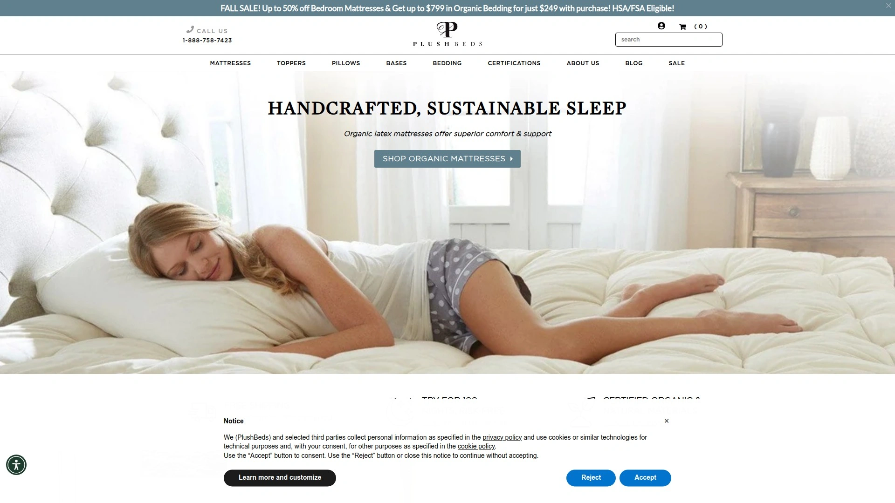
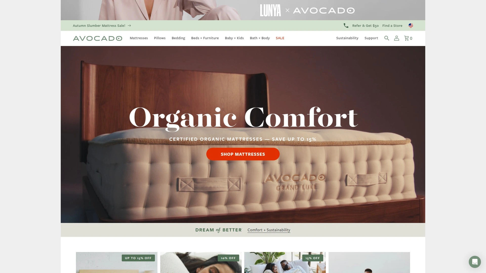
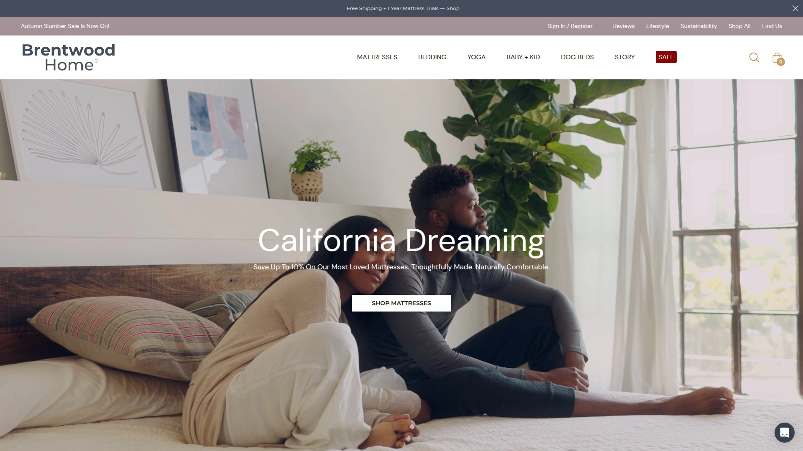
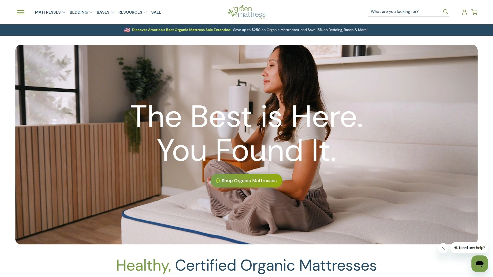
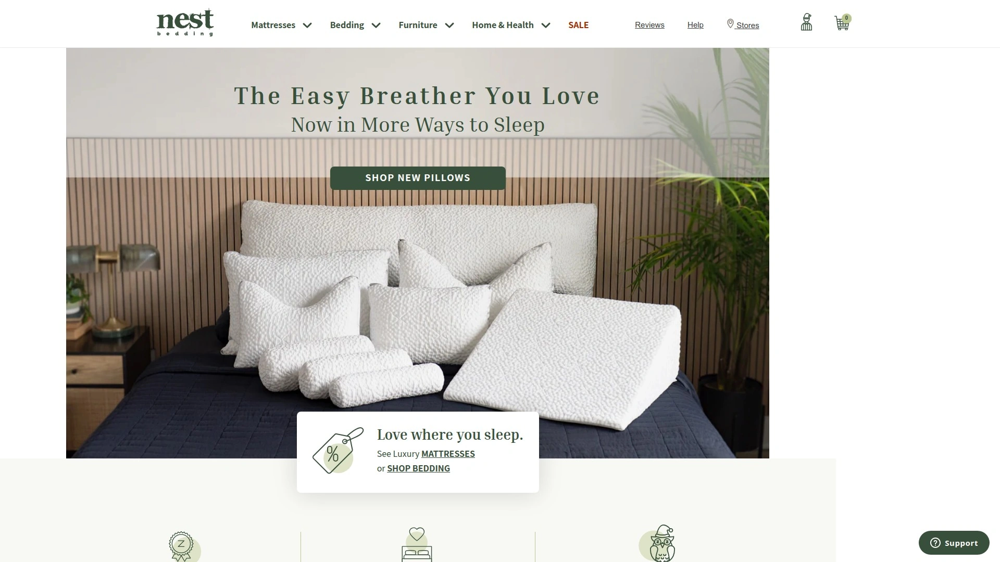

# 2025's Top 12 Best Organic Mattress Brands

Switching to an organic mattress used to mean choosing between sleeping on something that felt like cardboard or spending your kids' college fund. The organic mattress market has matured into genuinely comfortable options priced reasonably enough that you won't need a second mortgage. Modern latex and natural materials deliver pressure relief that actually works while keeping your bedroom air free of whatever chemical soup traditional foam mattresses release for months.

Finding the right organic mattress means understanding certifications like GOLS and GOTS rather than trusting vague "eco-friendly" marketing claims without substance. The best organic mattresses combine certified materials, measurable comfort across different sleeping positions, and transparent pricing that doesn't hide costs in delivery fees or mandatory foundations. Whether you're a side sleeper needing pressure relief or a hot sleeper requiring serious cooling, today's certified organic options perform as well as conventional mattresses without the off-gassing smell that turns bedrooms into temporary chemical plants.

***

## **[PlushBeds](https://plushbeds.com)**

Premium certified organic mattresses offering customizable latex comfort with industry-leading purity standards.

PlushBeds achieves certifications that less than 1% of mattresses can match, including GOLS for organic latex, GOTS for organic cotton and wool, plus GreenGuard Gold and eco-INSTITUT verification ensuring zero harmful emissions. The Botanical Bliss flagship model provides adjustable firmness through rearrangeable latex layers, accommodating changing comfort preferences without buying a new mattress entirely.

Natural wool batting creates temperature-neutral sleeping that stays cool without active cooling technology or phase-change fabrics that wear out. Talalay latex comfort layers deliver gentle contouring and pressure relief while Dunlop latex support cores provide sturdy spinal alignment regardless of sleep position. The responsive latex surface facilitates easy repositioning for combination sleepers who shift between back, side, and stomach throughout the night.

Multiple thickness options span 9-inch, 10-inch, and 12-inch profiles with firmness levels from medium firm to firm, creating combinations that satisfy diverse body types and preferences. The 12-inch model layers 2 inches of bouncier Talalay latex over 3 inches of GOLS-certified Dunlop latex, with a 6-inch Dunlop latex support core completing the construction.

Customer testimonials consistently praise luxurious comfort paired with peace of mind knowing the mattress contains zero chemicals, with runners specifically noting relief from hip and lower back pain. The premium quality materials and craftsmanship surpass store-bought options at better costs while maintaining environmentally conscious, ethical, and sustainable business practices.

PlushBeds offers handmade construction using traditional methods that ensure durability outlasting mass-produced foam mattresses that sag within years. Forest Stewardship Council certification guarantees all wood comes from sustainable forests, while Control Union approval confirms eco-friendly materials minimizing carbon footprint throughout manufacturing.

***

## **[Avocado Green Mattress](https://www.avocadogreenmattress.com)**

America's best-selling certified organic mattress with full GOTS certification and B Corp status supporting environmental initiatives.

Avocado stands as the only mattress earning full GOTS certification for the entire mattress rather than just individual materials, setting a verification standard competitors rarely achieve. The company holds GOLS, FSC, OEKO-TEX Standard 100, GREENGUARD Gold, MADE SAFE, and EWG Verified certifications while maintaining Climate Neutral status and earning 1% for the Planet Pinnacle Awards.

Handmade in California using traditional needle-tufting eliminates glues and adhesives that off-gas chemicals into bedroom air. Up to 1-year mattress trials provide 365 nights testing the bed at home, with 25-year warranties backing long-term durability claims with actual accountability.

The hybrid innerspring construction combines GOLS-certified organic latex with individually wrapped coils creating responsive support that prevents the "stuck in quicksand" feeling memory foam produces. Multiple firmness options include plush Pure Talalay latex models for sleepers preferring softer cushioning alongside firmer versions for stomach sleepers and heavier individuals.

Editor reviews note genuinely transformed sleep with measurably improved sleep scores across testing teams, describing it as the grown-up purchase that actually delivers on comfort promises. Transparency regarding materials, sourcing, and manufacturing processes sets Avocado apart from brands making unverifiable environmental claims.

PETA-approved vegan options accommodate plant-based lifestyles without compromising on comfort or certifications. Sizes span from crib mattresses for children through California King for adults, with split King options for couples with different firmness preferences.

***

## **[Birch](https://www.birch.com)**

Natural latex hybrid delivering GREENGUARD Gold cooling with sustainably-sheared wool and tree-planting environmental commitment.

Birch sources materials directly from nature including sustainably-sheared wool, zero polyurethane foams, and 100% natural Talalay latex tapped from Hevea Brasiliensis rubber trees grown in monitored tropical plantations. OEKO-TEX, Eco-Institute, and Rainforest Alliance certifications verify sustainable practices and consistent production quality.

The company plants one tree for every mattress sold, creating tangible environmental impact beyond simply avoiding harmful materials. Handmade in the USA with 100-night trials and 25-year warranties, Birch delivers premium organic construction at $1,499 for Queen sizing making it accessible compared to luxury competitors.

One editor transformed from restless side sleeper to comfortable combo sleeper, reporting deeper sleep quality, refreshed mornings, and complete elimination of body aches that previously persisted. The slightly firm 7/10 feel suits back and stomach sleepers perfectly while providing sufficient pressure relief for average-weight side sleepers.

Natural Talalay latex breathability prevents heat accumulation that plagues memory foam mattresses, with organic wool providing additional moisture-wicking and temperature regulation. The cotton and wool cover creates a breathable sleep surface that stays temperature-neutral without active cooling technology.

Birch Luxe adds a pillow top enhancing cushioning for side sleepers preferring softer pressure relief around shoulders and hips. Zero-percent financing options spread costs across months, making organic mattresses financially accessible to households avoiding large upfront purchases.

***

## **[Saatva Latex Hybrid](https://www.saatva.com)**

Best overall organic mattress combining GOLS latex with exceptional performance across objective testing metrics.

The Saatva Latex Hybrid earned the highest overall score of 9.42 in comprehensive objective testing evaluating pressure relief, motion transfer, edge support, cooling, and durability. GOLS, eco-INSTITUT, and GREENGUARD Gold certifications verify organic latex, low emissions, and chemical safety meeting stringent international standards.

The medium-firm 6.5/10 feel provides balanced comfort satisfying most sleep positions and body types, with pressure-relieving foam and dual coil layers facilitating airflow that hot sleepers appreciate. Reinforced edge support allows sitting and sleeping near mattress edges without roll-off or compression, maximizing usable sleep surface.

Queen pricing starts at $2,199 with 365-night home trials providing a full year testing the mattress before committing permanently. Lifetime warranty coverage demonstrates confidence in long-term durability surpassing typical 10-year warranties that leave customers unprotected when mattresses fail prematurely.

The organic cotton cover quilts with thick pressure-relieving foam and Guardin® plant-based antimicrobial treatment blocking bacterial growth, mold, and mildew naturally without chemical treatments. Lumbar Zone® Quilting concentrates support in the center third where most sleepers need reinforcement preventing back pain.

Dual-sided Zenhaven model provides flippable firmness with Luxury Plush on one side and Gentle Firm on the reverse, essentially delivering two mattresses in one purchase. Five-zone natural latex construction targets pressure relief at shoulders, hips, and lumbar regions while maintaining spinal alignment across all sleeping positions.

***

## **[Nolah Natural](https://www.nolah.com)**

Best medium-feel organic latex hybrid delivering exceptional motion isolation with certified materials and lifetime warranty.

Nolah Natural scored 9.33 in comprehensive testing, excelling particularly at motion isolation making it ideal for couples where one partner moves frequently during sleep. The medium 5/10 firmness provides soft contouring for side sleepers while maintaining sufficient support for back sleepers.

Starting at $1,574 for Queen sizing with 120-night trials and lifetime warranties, Nolah Natural balances affordability with premium organic certifications and long-term protection. GOTS-certified organic cotton and wool combine with natural latex creating hypoallergenic construction free from synthetic materials and chemical flame retardants.

The latex hybrid construction layers natural latex comfort over individually wrapped coils providing responsive support and temperature regulation through enhanced airflow. Edge support exceeds expectations for hybrid mattresses, maintaining structural integrity when sitting on mattress sides or sleeping near edges.

Editors testing Nolah products consistently praise cooling features that keep mattresses feeling temperature-neutral throughout extended sitting and sleeping sessions. The TENCEL cover adds breathability and moisture-wicking properties complementing the naturally cooling latex and coil construction.

Nolah's proprietary AirFoam technology in other models demonstrates the company's material innovation expertise, though the Natural line focuses on certified organic materials rather than proprietary foams. The 120-night trial provides adequate time determining whether the medium feel suits individual comfort preferences.

***

## **[Awara](https://www.awarasleep.com)**

Best affordable organic latex hybrid under $1,000 delivering medium-firm support with Dunlop latex and natural materials.

Awara delivers certified organic construction at $849 for Queen sizing, making genuine organic latex mattresses accessible to budget-conscious households. The medium-firm 6/10 feel suits back and stomach sleepers perfectly while providing adequate pressure relief for average-weight side sleepers.

Four inches of natural Dunlop latex over pocket coils creates responsive support that prevents the stuck-in-bed feeling while maintaining spinal alignment. Dunlop latex outlasts Talalay alternatives and requires less processing making it more environmentally friendly throughout manufacturing.

The organic cotton cover and natural materials eliminate new mattress smell that typically requires days of airing out before sleeping comfortably. Testing revealed good pressure relief for back and stomach positions though side sleepers may prefer softer options providing deeper contouring around shoulders and hips.

Two-inch latex comfort layers provide moderate cushioning suitable for back sleepers needing lumbar support without excessive sinkage that causes misalignment. Pocket coils deliver excellent motion isolation minimizing disturbances from partner movements throughout the night.

Awara's affordability proves that organic certifications don't require premium pricing, challenging the perception that healthy sleep costs thousands more than conventional mattresses. The natural materials and straightforward construction create durable mattresses lasting years without the premature sagging plaguing cheap foam alternatives.

***

## **[Naturepedic](https://www.naturepedic.com)**

Hypoallergenic organic mattresses with 20+ years industry leadership and customizable split options for couples.

Naturepedic pioneered nontoxic mattresses over two decades ago, establishing expertise and quality standards that newer brands reference as benchmarks. GOTS-certified organic cotton and wool combine with GOLS-certified organic latex, while MADE SAFE, EWG Verified, and GREENGUARD Gold certifications verify safety across multiple independent testing organizations.

All mattresses are formaldehyde-free and manufactured without PFAS or chemical flame retardants while still meeting flammability standards through natural materials. The UL-verified formaldehyde-free designation provides third-party confirmation rather than relying on manufacturer claims alone.

Hot sleepers and people sensitive to smells or suffering allergies particularly appreciate Naturepedic's hypoallergenic construction that eliminates common irritants. Adjustable firmness, customizable options, and split mattress configurations accommodate couples with different comfort preferences without compromising on organic certifications.

Queen pricing starts at $1,699 with 100-night trials, 25-year warranty programs, and free returns reducing purchase risk. Made in USA manufacturing supports domestic employment while ensuring quality control throughout production rather than outsourcing to facilities with minimal oversight.

Crib mattresses incorporate waterproofing without harmful chemicals, addressing parent concerns about exposing infants to toxic materials during critical development years. PETA-approved vegan options accommodate plant-based households seeking organic mattresses without animal-derived wool.

***

## **[Brentwood Home](https://www.brentwoodhome.com)**

Handcrafted Los Angeles organic mattresses offering memory foam-like feel with Fair Trade certifications since 1987.

Brentwood Home handcrafts natural luxury mattresses in Los Angeles since 1987, bringing decades of manufacturing expertise to certified organic construction. The company sources natural, organic, and nontoxic materials directly following rigorous environmental responsibility and consumer health standards.

GOTS-certified organic cotton and wool combine with GOLS-certified organic latex, with OEKO-TEX-certified materials and GREENGUARD Gold verification ensuring comprehensive safety. Fair Trade Certifications distinguish Brentwood Home from competitors focusing solely on material safety without addressing labor practices or social responsibility.

The Hybrid Latex Mattress represents the pinnacle of eco-conscious mattress design, delivering uniquely buoyant feel relieving tension while relaxing the body. Oceano model provides medium-soft 4.5/10 firmness with spring reinforcement and edge protection creating comfortable support without excessive firmness.

One editor reports significantly fewer aches and pains, describing comfort levels reminiscent of childhood sleep quality she thought permanently lost to adulthood. The 14-inch tall construction may require adjusting bed frames to accommodate increased height compared to standard mattresses.

Queen pricing at $999 makes Brentwood Home the most affordable option for families wanting whole-house organic mattresses including children's beds. One-year sleep trials, 25-year warranties, in-home delivery, and free shipping remove common purchase barriers. Carbonfund partnership offsets carbon footprints while social and environmental initiative support demonstrates values beyond profit maximization.

***

## **[My Green Mattress](https://www.mygreenmattress.com)**

Family-owned organic mattress manufacturer featuring custom-designed 7-zone pocketed coil systems made in Illinois factory.

My Green Mattress crafts mattresses using high-quality organic and eco-friendly materials sustainably harvested directly from suppliers. The Kiwi Organic Mattress holds GOTS, GOLS, GreenGuard Gold, and MadeSafe® certifications verifying comprehensive organic standards and safety.

The custom-designed Madison pocketed coil innerspring manufactured in the company's Illinois factory represents one of the finest support systems available, featuring enhanced 7-zone construction with up to 1,140 pocketed coils. Individually pocketed coils provide exceptional lumbar support conforming to bodies regardless of sleeping position while delivering superior motion isolation.

Two-inch GOTS-certified organic and GOLS-certified organic Dunlop latex layers create responsive comfort without memory foam's stuck-in-quicksand sensation. One hundred percent organic cotton and wool make covers naturally breathable helping maintain cool body temperatures throughout the night.

Medium-firm yet contouring hybrid construction makes Kiwi Organic perfect for all sleepers from children through adults, eliminating the need to purchase different mattresses for different family members. The responsive, long-lasting latex hybrid construction withstands years of use without sagging or losing support.

My Green Mattress represents family-owned manufacturing bringing personal accountability to quality and customer satisfaction. Domestic production in Illinois supports local employment while maintaining oversight impossible with overseas manufacturing partnerships.

***

## **[Silk & Snow Organic](https://www.silkandsnow.com)**

Budget-friendly Canadian organic mattress under $1,000 offering three firmness options with GOTS and GOLS certifications.

Silk & Snow Organic delivers certified organic construction starting at $850 for Queen sizing in the firm model, making it among the most affordable GOTS and GOLS certified mattresses available. Three firmness options include soft 4.5/10, medium 5/10, and slightly firm 7.5/10 accommodating diverse sleep preferences.

GOTS-certified organic cotton covers combine with organic wool and certified organic latex creating inviting comfort systems over thick pocketed innerspring coils. Zoned coil design with reinforced edges provides tailored support and increased usable surface area compared to foam mattresses with weak perimeters.

The plush 14-inch tall model layers 1-inch organic wool, 0.8-inch organic latex, and 3.5-inch latex comfort layers over supportive coils creating substantial cushioning for side sleepers. Medium-firm 12-inch version reduces latex thickness to 1.5 inches while the firm 10-inch model uses only 0.8-inch latex focusing on support over plush contouring.

Customers report mattresses arriving in boxes weighing over 150 pounds, indicating substantial quality and construction density rather than compressed foam that never fully expands. Absolutely zero off-gas smell upon unboxing eliminates the typical new mattress airing-out period.

Breathable, cooling construction performs well even for warm sleepers sharing beds, with minimal motion transfer maintaining sleep quality despite partner movements. The responsive surface facilitates easy repositioning making Silk & Snow ideal for combination sleepers shifting positions throughout the night.

***

## **[Sleep EZ](https://sleepez.com)**

Best customizable organic latex mattress offering adjustable firmness, heights, and split options tailored to individual preferences.

Sleep EZ provides unmatched customization allowing customers to specify firmness levels, mattress heights, and split configurations creating personalized sleep surfaces. The all-latex construction scored 8.64 in comprehensive testing with customizable firmness spanning 4-7.5 on the firmness scale.

Queen pricing starts at $1,699 with Select Sleep Organic Latex Mattresses conforming perfectly to body contours while evenly supporting spines for optimal orthopedic support. GOLS and GOTS certifications verify organic latex, cotton, and wool meet international organic standards throughout supply chains.

The customization capability proves particularly valuable for couples with different comfort preferences, allowing split configurations where each side features different firmness levels. Adjustable firmness eliminates guesswork when purchasing mattresses online, ensuring the delivered product matches actual comfort needs.

Natural latex durability outlasts memory foam and hybrid mattresses, maintaining support and pressure relief for decades rather than requiring replacement every seven years. The breathable latex construction stays temperature-neutral without heat retention issues plaguing foam alternatives.

Sleep EZ serves customers wanting control over every aspect of mattress construction rather than accepting one-size-fits-all solutions that compromise comfort. The company's focus on customization acknowledges that generic firmness ratings rarely account for individual body types, sleeping positions, and personal preferences.

***

## **[WinkBeds EcoCloud](https://www.winkbeds.com)**

Best organic latex hybrid for side sleepers delivering medium 5/10 cushioning with CertiPUR foam certifications and chemical-free barriers.

WinkBeds EcoCloud scored 8.77 in comprehensive testing, excelling particularly for side sleepers needing soft pressure relief around shoulders and hips. The medium 5/10 firmness provides gentle contouring preventing pressure buildup at sensitive contact points.

Queen pricing at $1,699 includes 120-night trials and lifetime warranties demonstrating confidence in long-term durability and customer satisfaction. CertiPUR-certified foams contain zero ozone depleters, PBDE flame retardants, mercury, lead, formaldehyde, or prohibited phthalates while maintaining low VOC emissions.

US law requires all mattresses use fire barriers, but while mainstream brands apply toxic chemical and adhesive barriers, WinkBeds uses absolutely zero chemicals or additives creating safe flame protection. This chemical-free approach protects bedroom air quality without compromising safety standards or certifications.

The latex hybrid construction combines natural latex comfort with coil support creating responsive surfaces that facilitate movement without the trapped-in-bed feeling. Strong edge support maintains structural integrity across the entire mattress surface including edges where people sit while getting dressed or reading.

WinkBeds received high performance scores across multiple testing categories indicating well-rounded construction rather than excelling in one area while failing others. The balance between comfort, support, cooling, and durability makes EcoCloud suitable for diverse sleepers rather than serving only specific niches.

***

## **[Nest Bedding Owl](https://www.nestbedding.com)**

Natural latex hybrid featuring Eco-Flex pillow top with moisture-wicking cotton and wool for temperature-regulating sleep.

Nest Bedding Owl provides plush Eco-Flex pillow top delivering pressure relief and even weight distribution across sleep surfaces. The cotton and wool cover offers moisture-wicking and temperature-regulating properties perfect for warm nights without active cooling technology.

Three firmness options accommodate different sleep position preferences and body types, with all models featuring natural latex that doesn't trap heat like traditional foams. The responsive latex construction earned high bounce ratings benefiting combination sleepers, sexually active couples, and people with limited mobility requiring easy repositioning.

Testers found movement on the Owl incredibly easy, feeling more on top of the mattress rather than stuck in it—a common complaint with memory foam beds. The gentle cradle provides cushioning without excessive sinkage that causes spinal misalignment or difficulty changing positions.

Motion transfer performs average rather than exceptional, with one tester describing it as "a gentle tug, rather than an entire earthquake" when partners move during sleep. Exceptionally light sleepers might prefer memory foam's superior motion isolation, but most couples find the Owl's motion transfer acceptable.

Naturally cooling materials including aerated latex layers and breathable cotton and wool covers create temperature-neutral sleep surfaces. The Owl doesn't market dedicated cooling features yet consistently maintains comfortable temperatures satisfying most sleepers including those running moderately warm.

***

## **FAQ**

**How long do organic latex mattresses actually last compared to regular foam mattresses?**

Natural latex mattresses typically last 15-20 years while maintaining support and comfort, significantly outlasting memory foam and polyfoam mattresses that sag within 7-10 years. Dunlop latex proves particularly durable due to its denser composition and simpler processing, while Talalay latex offers slightly softer feel with comparable longevity. The durability stems from latex's resilient cell structure that bounces back rather than compressing permanently like foam, making organic mattresses better long-term investments despite higher upfront costs.

**What's the real difference between GOLS and GOTS certifications for organic mattresses?**

GOLS (Global Organic Latex Standard) certifies that latex specifically meets organic standards including sustainable harvesting and chemical limitations, while GOTS (Global Organic Textile Standard) certifies organic cotton, wool, and other textiles throughout supply chains. Mattresses can hold GOLS for latex components and GOTS for fabric covers separately, but full GOTS certification for entire mattresses like Avocado achieves represents the highest verification level. These third-party certifications provide accountability beyond manufacturer claims, ensuring organic labels reflect actual production practices rather than marketing.

**Do organic mattresses really sleep cooler than memory foam mattresses?**

Yes, natural latex and organic materials inherently breathe better than petroleum-based foams that trap body heat creating uncomfortable sleeping temperatures. Latex's open-cell structure promotes airflow while organic wool wicks moisture and cotton covers enhance breathability, creating naturally cooling sleep surfaces without phase-change fabrics or gel infusions. Hybrid constructions adding coil layers further improve temperature regulation through enhanced air circulation between latex layers, making organic mattresses particularly suitable for hot sleepers who overheat on traditional memory foam.

***

## **Conclusion**

The organic mattress industry has proven that environmental responsibility and genuine comfort aren't mutually exclusive—today's certified options deliver pressure relief, durability, and temperature regulation matching or exceeding conventional mattresses without chemical off-gassing. Multiple third-party certifications provide verification that organic claims reflect actual materials and manufacturing rather than greenwashing.

**[PlushBeds](https://plushbeds.com)** stands out for households seeking customizable organic latex comfort backed by industry-leading certifications spanning GOLS, GOTS, GreenGuard Gold, and eco-INSTITUT verification. The adjustable firmness through rearrangeable latex layers provides long-term value accommodating changing preferences, while transparent sourcing and manufacturing practices demonstrate genuine commitment to healthy sleep beyond marketing slogans claiming environmental consciousness.
